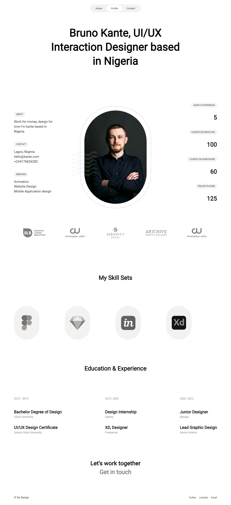

# Frontend Practice - 
This is a solution to the[[ Frontend Practice](https://www.frontendpractice.com/projects/oh-studio). Frontend practice challenges help you improve your coding skills thet take your frontend skills to the next level by recreating real websites.

## Table of contents

- [Frontend Practive - Insure landing page solu](#oh design)
  - [Table of contents](#table-of-contents)
  - [Overview](#overview)
    - [Requirements](#requirements)
    - [The challenge](#the-challenge)
    - [Screenshot](#screenshot)
    - [Links](#links)
  - [My process](#my-process)
    - [Built with](#built-with)
    - [What I learned](#what-i-learned)
    - [Continued development](#continued-development)
    - [Useful resources](#useful-resources)
  - [Author](#author)

## Overview
### Requirements
- Responsive fluid layout 
- hover states
- sticky navigation header
- fade Transitions
- Animations
### The challenge

Users should be able to:

<!-- - View the optimal layout for the site depending on their device's screen size
- See hover states for all interactive elements on the page -->

### Screenshot

### Links

- Solution URL: [@github](https://github.com/alialaba/DE-DESIGN)
- Live Site URL: [@netlify](https://designer-showcase.netlify.app/)

## My process

### Built with

- Semantic HTML5 markup
- DOM
- Dummy Datas
- CSS custom properties
- CSS Grid
- Transition/ Animation

### What I learned
<!-- - Strengthen my knowledge on BEM pattern for naming convention.
- Understand the trick of min css property and minmax() with grid Css
- Enhance my css positioning skills and usage of pseudo elements -->

### Continued development
- scroll animation
- fading with intersection observer
- DOM
<!-- - Css positioning and pseudo element
- Responsiveness (fluid spacing, layout and fluid font size).  -->

### Useful resources

[aria-current](https://developer.mozilla.org/en-US/docs/Web/Accessibility/ARIA/Attributes/aria-current) - This helped to achieve setting/representing  the current item. e.g To show active nav link.
[fading up sections using intersection-observer](https://dev.to/jslim/fading-up-sections-using-intersection-observer-3fhj)
[Fixed Vs Sticky Position](https://www.kevinpowell.co/article/positition-fixed-vs-sticky/)
[filter in css](https://css-tricks.com/almanac/properties/f/filter/) - This helped to achieve img grayscale.

<!-- - [A Deep Dive Into CSS Grid minmax()]() - This helped me  to achieve a 3 column responsive layout with 3 lines of code. I really liked this pattern and will use it going forward.
- [Background position]() - This is an amazing article which helped me finally understand to position bg images in x and y axis. I'd recommend it to anyone still learning this concept. -->

## Author

- Website - [Aliyu AbdulGaniy](https://www.github.com/alialaba)

- Twitter - [@thisaliaba](https://www.twitter.com/thisaliaba)

